# detect-lines

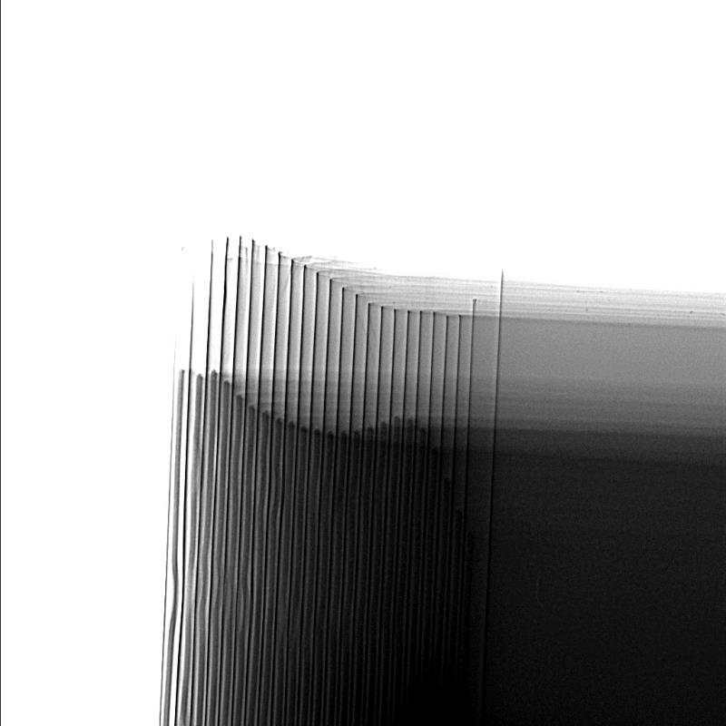

## Overview

**detect-lines** is a C++ project that implements advanced line detection and separation techniques for digital images.  
It combines classic computer vision (OpenCV), frequency-domain analysis (spectral methods), geometric filtering, and optimization techniques to robustly detect structural lines in images with noise, texture, or uneven illumination.

This project is particularly suited for tasks such as:
- Detecting boundaries or separation lines in scanned documents, maps, or technical drawings
- Identifying dominant structural features (edges, borders, stripes) in natural images
- Preprocessing images for later pattern recognition or geometric analysis

---

* Image reading
* Image low pass filtering
* Emphasis on low image intensities:
* Background subtraction, horizontal stripes removal

* Obtaining one-dimensional (special case) Fourier spectra for image fragments using https://github.com/leerichardson/tree-swdft-2D
* Finding the separation line points where spectra main frequencies abruptly change
* Preliminary filtering of points using cv::partition and nanoflann library 
* Using RANSAC to find the separation line using separation line points
* Using CERES solver to refine the separation line

* Using both adaptiveThreshold and binary background subtraction to generate threshold image
* Using thinning to obtain lines skeletons
* Calling erode/dilate to filter out vertical lines
* Invoking HoughLinesP to generate lines from skeletons
* Merging lines according to https://stackoverflow.com/a/51121483/10472202
* Filtering out short lines
* Cutting lines using the RANSAC/CERES separation line mentioned above
* Filtering out short lines once more

* Search for the beginnings of short stripes with "known good" SURF data
* Movement to the left and up along long lines

* Merging HoughLinesP and SURF results to obtain the final data

---

## Technical Architecture

The project is structured as a modular C++/OpenCV pipeline:

### 1. Input and Preprocessing
- **`main.cpp`**  
  Entry point. Reads image(s), invokes the detection pipeline, and writes results.  
- **Preprocessing steps:**  
  - Image loading (`cv::imread`)  
  - Optional downscaling for speed  
  - Low-pass filtering (Gaussian blur)  
  - Intensity emphasis on darker features  
  - Background subtraction and horizontal stripe removal  

---

### 2. Frequency-Domain Line Candidate Detection
- **`tswdft2d.h` integration**  
  Uses **tree-structured sliding-window DFT (SWDFT)** to compute localized spectra.  
- Detects **frequency discontinuities**: sudden changes in spectral energy correspond to possible separation lines.  
- Produces a set of candidate “line points” across image fragments.

---

### 3. Geometric Filtering
- **`detect-lines.cpp/.h`**  
  Core functionality:  
  - Uses `cv::partition` to cluster nearby candidate points.  
  - Uses `nanoflann.hpp` (KD-tree) for efficient nearest-neighbor queries and spatial filtering.  
- Output: refined set of potential line-supporting points.

---

### 4. Model Fitting and Refinement
- **RANSAC**  
  Robustly fits a line to candidate points while ignoring outliers.  
- **Ceres Solver**  
  Refines the fitted model to minimize geometric error. Provides sub-pixel accuracy and robust handling of noisy data.  
- **`known-good.cpp/.h`**  
  Contains reference/validation code for verifying correct line detection.

---

### 5. Morphological and Skeleton Processing
- Adaptive thresholding and background subtraction produce a binarized image.  
- **Morphological thinning** generates a skeleton representation.  
- **Erosion/Dilation** filters out vertical lines when needed.

---

### 6. Probabilistic Hough Transform
- OpenCV’s `cv::HoughLinesP` is used to detect line segments from skeletonized images.  
- Detected segments are filtered based on:
  - Orientation  
  - Length  
  - Consistency with RANSAC/Ceres line model  

---

### 7. Output
- Result images are stored under `results/`, including intermediate visualizations such as:
  - Reduced candidate lines
  - Skeletons
  - Hough transform output
  - Final refined separation line

---

## Code Components

| File              | Purpose                                                                 |
|-------------------|-------------------------------------------------------------------------|
| `main.cpp`        | Orchestrates the pipeline, handles I/O and visualization.              |
| `detect-lines.*`  | Core algorithms for candidate point detection and line filtering.       |
| `convert.cpp`     | Image conversions and helper routines.                                 |
| `known-good.*`    | Reference validation routines and test logic.                          |
| `nanoflann.hpp`   | KD-tree library for fast nearest-neighbor queries.                     |
| `tswdft2d.h`      | Tree-structured SWDFT for localized Fourier analysis.                  |
| `CMakeLists.txt`  | Build system configuration (CMake).                                    |

---

## Algorithmic Highlights

1. **Hybrid Spatial–Frequency Approach**  
   - Spatial domain: filtering, thresholding, morphology.  
   - Frequency domain: discontinuity detection using SWDFT.  

2. **Multi-Stage Line Refinement**  
   - Candidate extraction → clustering → RANSAC → Ceres optimization.  

3. **Efficiency Considerations**  
   - KD-tree search (`nanoflann`) for scalable point clustering.  
   - Intermediate results stored for debugging and reproducibility.  

---

## Results

Example outputs are stored under `results/`:

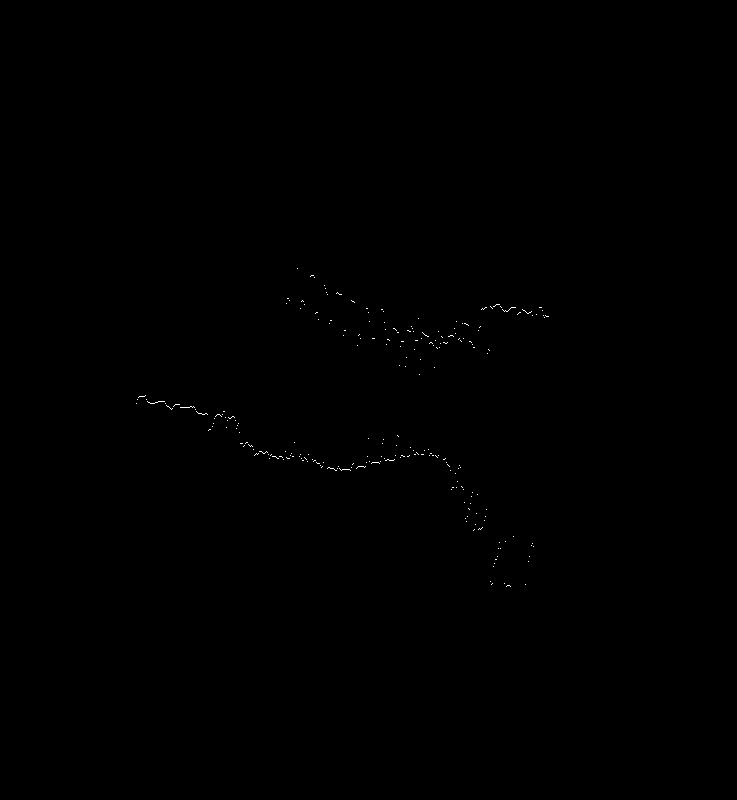
_-_Probabilistic_Line_Transform.jpg)
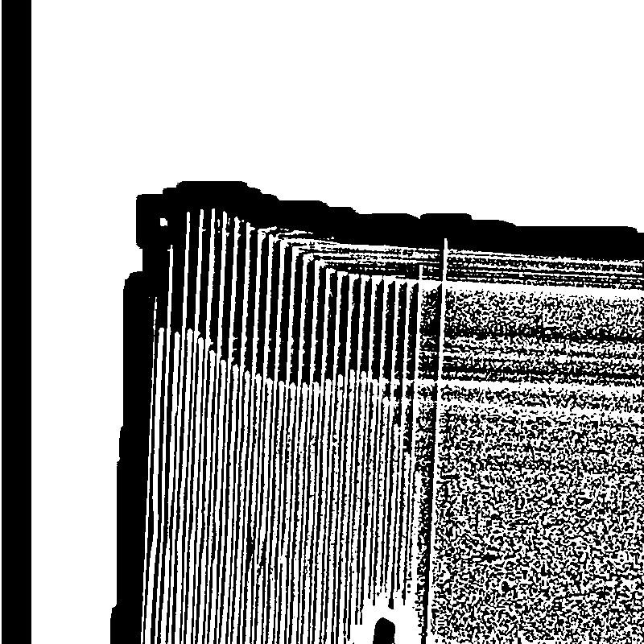
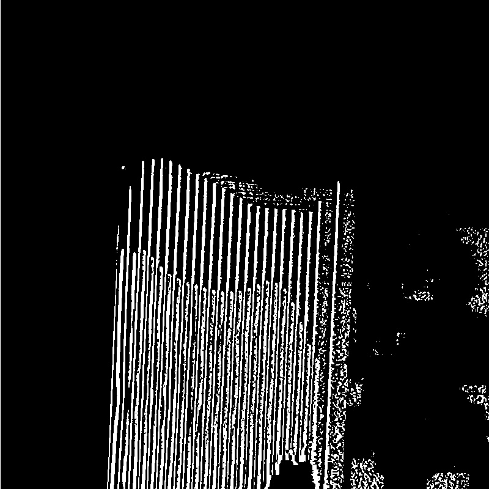

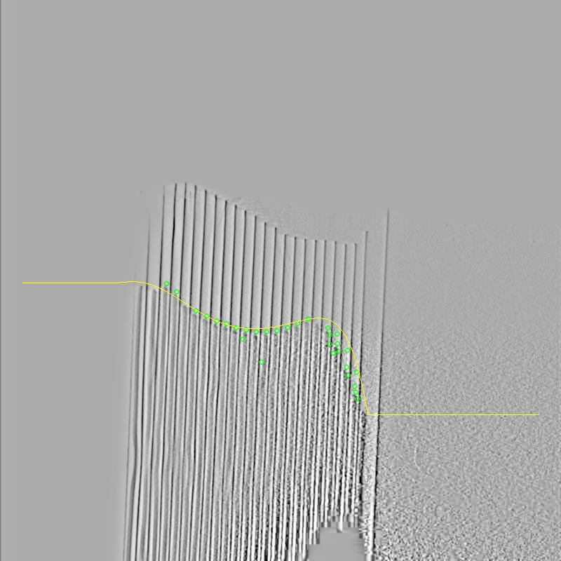
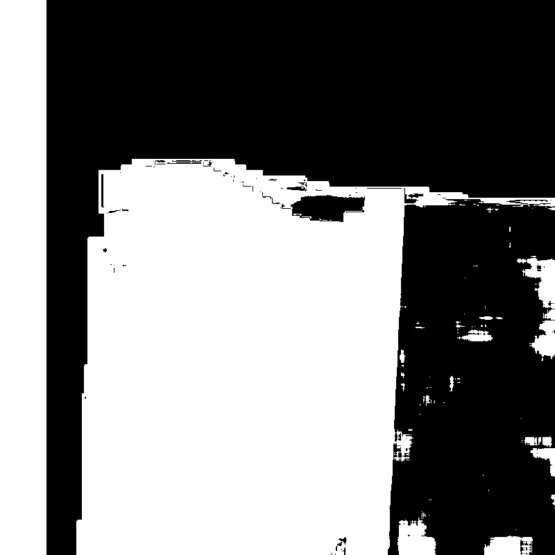
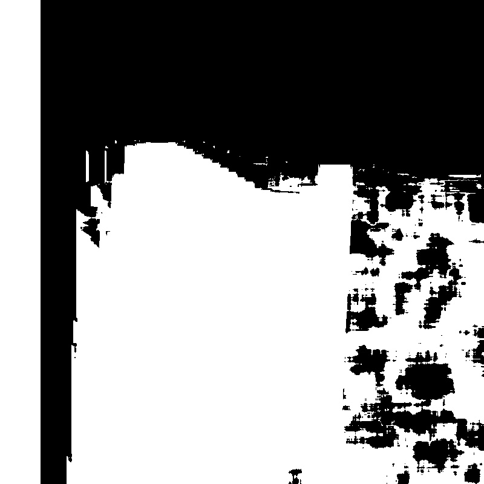
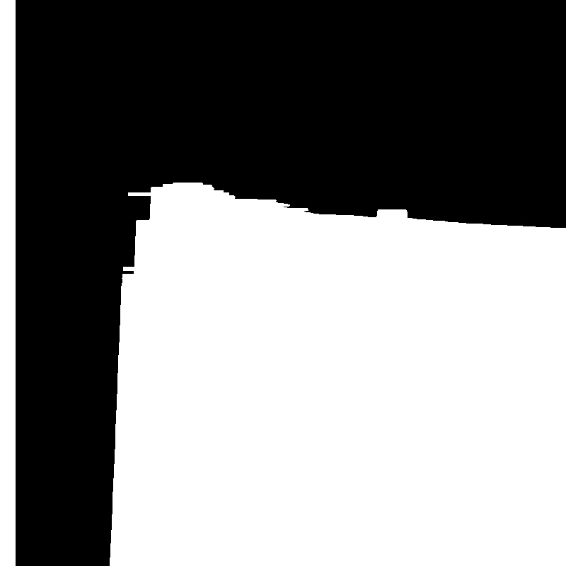
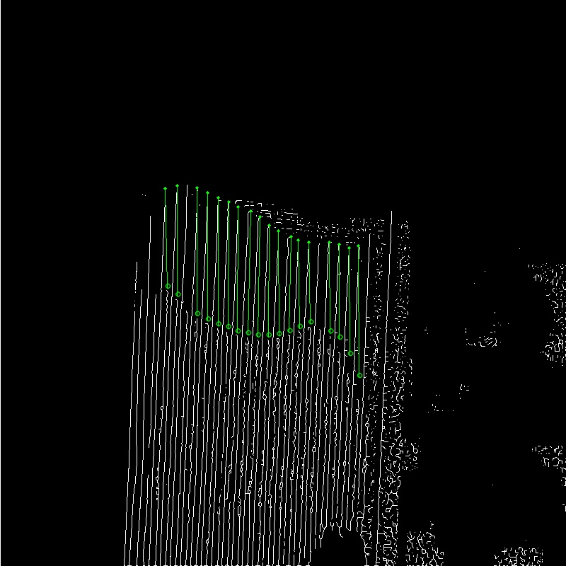
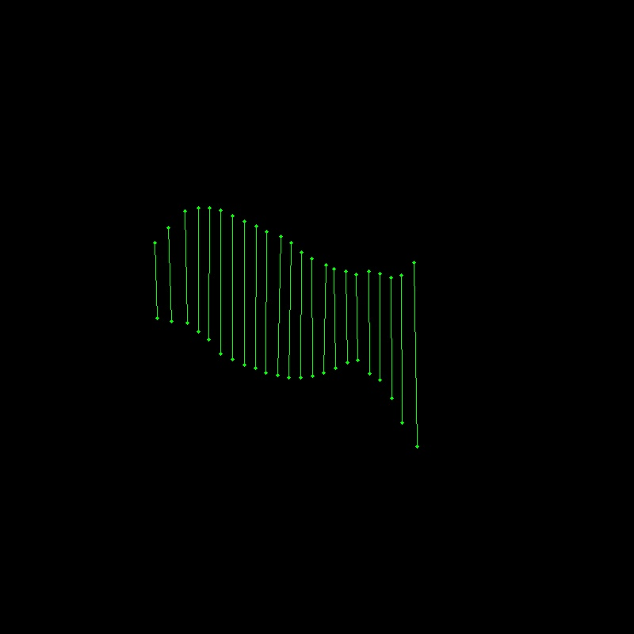
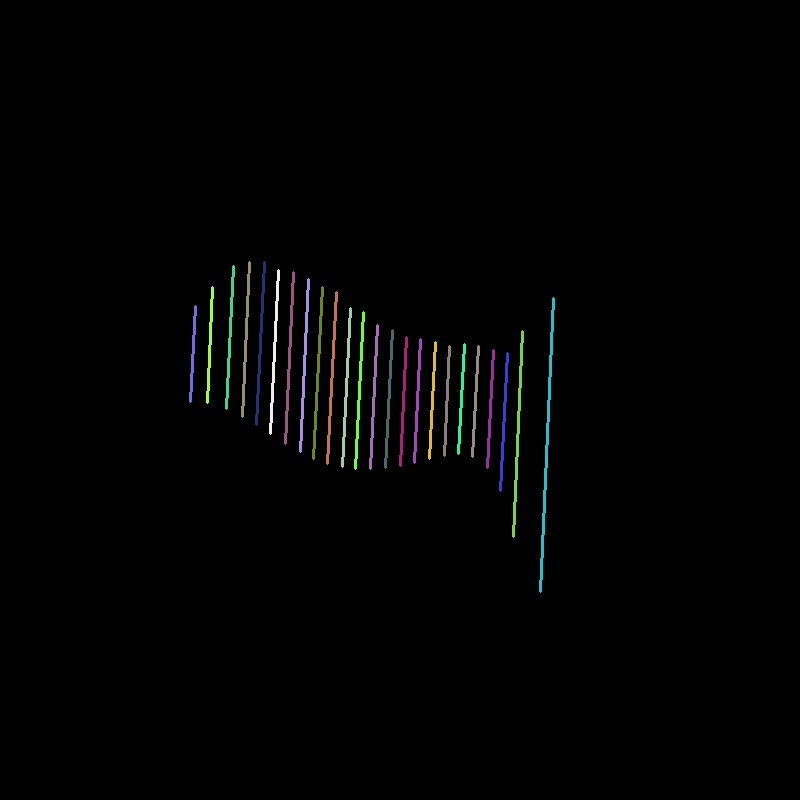
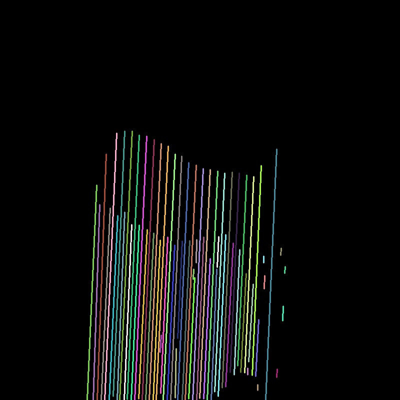
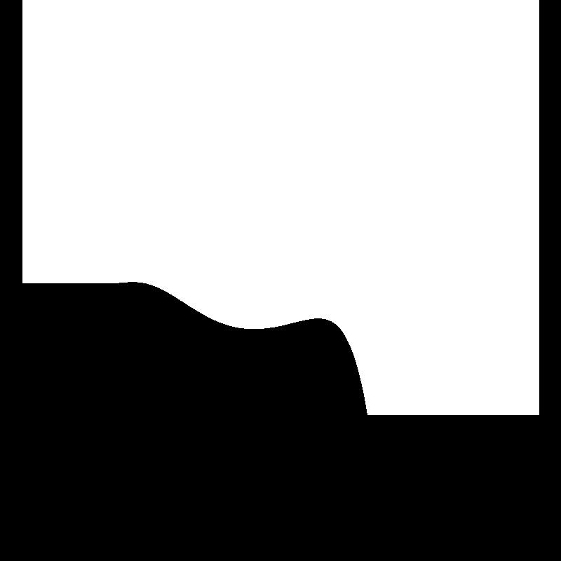
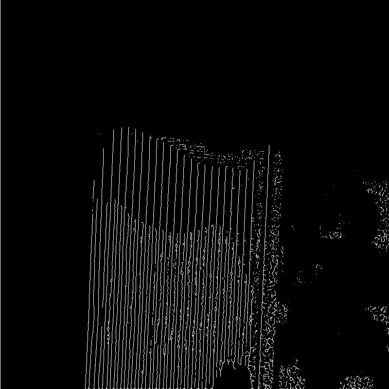
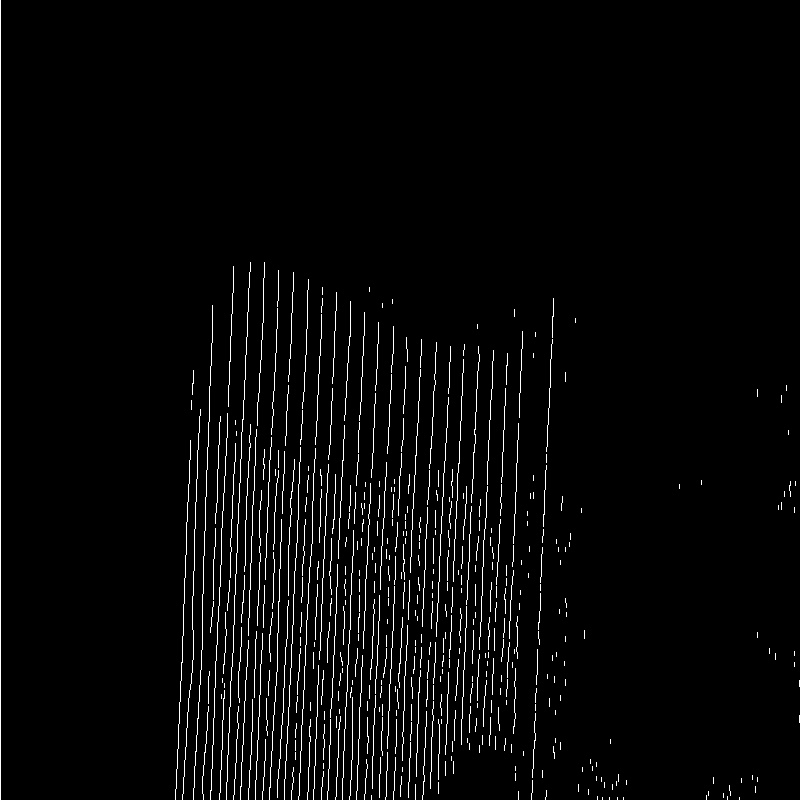

These demonstrate the progressive filtering and refinement pipeline.

---

## Technical Architecture

### 1. Thinning Algorithm

The code provides implementations of **Zhang–Suen** and **Guo–Hall** thinning methods to reduce binary images to skeletons:

```cpp
enum ThinningTypes {
    THINNING_ZHANGSUEN = 0,  // Zhang-Suen thinning
    THINNING_GUOHALL   = 1   // Guo-Hall thinning
};

// Applies one thinning iteration
void thinningIteration(cv::Mat& img, int iter, ThinningTypes type);

```

Skeletonization makes subsequent Hough line detection more robust.

### 2. Candidate Line Detection (Spectral + Spatial)
Spectral analysis finds abrupt changes in local Fourier spectra:

```cpp
// Sliding Window DFT for 2D fragments
#include "tswdft2d.h"

// Detect separation line points where spectra change
std::vector<cv::Point> detectFrequencyDiscontinuities(const cv::Mat& fragment);
```
Points are then clustered using OpenCV and nanoflann:

```cpp
// KD-tree neighbor search
nanoflann::KDTreeSingleIndexAdaptor<
    nanoflann::L2_Simple_Adaptor<double, PointCloud>,
    PointCloud, 2> index(2, cloud, KDTreeParams(10));
```
### 3. RANSAC Model Fitting
Robust line fitting rejects outliers:

```cpp
cv::Vec4f fittedLine;
cv::fitLine(candidatePoints, fittedLine,
            cv::DIST_L2, 0, 0.01, 0.01);
```
### 4. Optimization with Ceres Solver
After RANSAC, line parameters are refined by nonlinear least squares using Ceres:

```cpp
struct LineResidual {
    LineResidual(double x, double y) : _x(x), _y(y) {}
    template <typename T>
    bool operator()(const T* const line, T* residual) const {
        residual[0] = line[0] * T(_x) + line[1] * T(_y) + line[2];
        return true;
    }
    double _x, _y;
};
```
This improves sub-pixel precision of the detected separation line.

### 5. Morphology + Hough Transform
The pipeline combines adaptive thresholding, skeletonization, and Hough Transform:

```cpp
cv::Mat edges;
cv::adaptiveThreshold(gray, edges, 255,
                      cv::ADAPTIVE_THRESH_MEAN_C,
                      cv::THRESH_BINARY, 15, -2);

// Probabilistic Hough Transform
std::vector<cv::Vec4i> lines;
cv::HoughLinesP(edges, lines, 1, CV_PI/180, 80, 30, 10);
```
Lines are then filtered based on orientation, length, and consistency.

